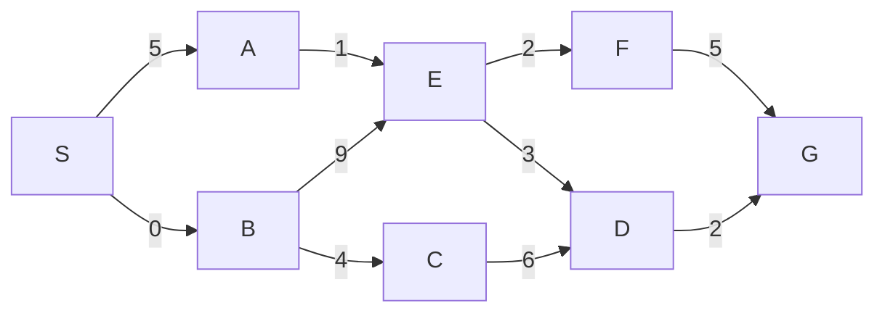
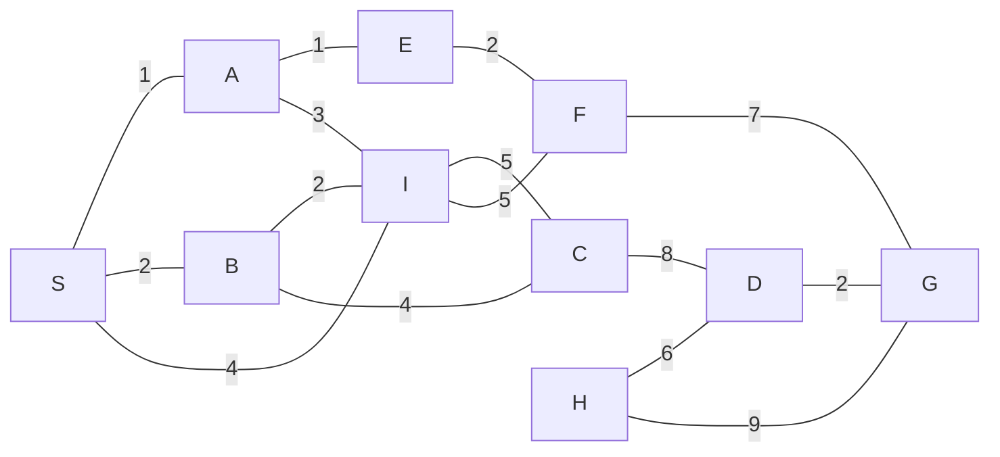

# Homework 3：概念复习

> 原文：https://sp21.datastructur.es/materials/hw/hw3/hw3.pdf<br>
> 日期：2021 年 5 月 5 日<br>
> 提交方式：本作业在 Gradescope 中作为 Quiz 评分，请在 Gradescope 输入最终答案。<br>
> 说明：正文由 ChatGPT 直接翻译；代码、方法名、顶点名和数学符号保持原样。

## 1. 有趣的堆

本题使用课上介绍的 3B 表示法表示堆：用数组存储，索引 `0` 留空，堆的根位于索引 `1`。

### (a) 执行操作后的数组

从空的最小堆开始，执行下面 12 个操作后，写出最终堆的数组表示。只需给出最后一步后的数组，无需写中间过程。

假设内部数组初始长度为 `8`，本题无需考虑扩容。若某个数组索引处为 `null` 或不属于堆的有效范围，请写 `-`。例如，若堆有 `k` 个元素，则数组中应有 `8-k` 个 `-`。初始状态为：

```text
[-, -, -, -, -, -, -, -]
```

每个逗号后写一个空格，并包含 `[`、`]`。索引 `0` 永远为空，因此始终写 `-`。

```java
MinHeap<Integer> h = new MinHeap<>();
h.add(1);
h.add(2);
h.add(20);
h.add(0);
h.add(4);
h.removeMin();
h.removeMin();
h.add(5);
h.add(3);
h.add(10);
h.add(1);
h.removeMin();
```

以下各小题中的陈述可能是“总是正确”“有时正确”或“从不正确”。请给出简短理由或反例。评分只看你的选项，不看理由；但写理由是重要的学习手段。

除非特别说明，下面所有堆均为含 `N` 个元素的最小堆。假设指定操作期间内部数组不会扩容。

### (b)

一次 `removeMin` 操作需要 Θ(`log N`) 时间。

### (c)

一次 `add` 操作的时间复杂度是 Ω(`1`) 且 O(`log N`)。

### (d)

给定一个含 `N` 个**互不相同**元素的最小堆，插入一个比堆中所有元素都小的新元素，随后立刻调用 `removeMin`，最终会得到插入前完全相同的原堆。

### (e)

给定一个含 `N` 个元素（元素**不一定唯一**）的最小堆，插入一个比堆中所有元素都小的新元素，随后立刻调用 `removeMin`，最终会得到插入前完全相同的原堆。假设下沉时若两个孩子相等，就与左孩子交换。

### (f)

任何最小堆的数组表示都按升序排列。

### (g)

若把每个结点的左孩子和右孩子互换（递归处理整棵树），结果仍是合法的最小堆。等价伪代码：

```java
public void swapRecursive(Node root) {
    if (root == null) {return;}
    Node tmp = root.right;
    root.right = root.left;
    root.left = tmp;
    swapRecursive(root.left);
    swapRecursive(root.right);
}
```

## 2. 最短路径

考察下面的有向加权图，并从顶点 `S` 开始运行 Dijkstra 算法。



使用课上介绍的 Dijkstra 版本：`fringe` 和 `distTo` 总是同时更新。

请分别写出：

1. 顶点 `B` 被访问后（即 `B -> C` 和 `B -> E` 已完成松弛）的 `edgeTo` 与 `distTo`；
2. Dijkstra 完全结束后的 `edgeTo` 与 `distTo`。

初始化时，每个顶点的 `edgeTo` 为 `-`，代表 `null`；每个顶点的 `distTo` 为 `inf`，代表 ∞，但 `S` 为 `0`。

第一次迭代前：

```text
edgeTo = {A:-, B:-, C:-, D:-, E:-, F:-, G:-, S:-}
distTo = {A:inf, B:inf, C:inf, D:inf, E:inf, F:inf, G:inf, S:0}
```

**映射必须严格按上述顺序书写。**即使映射关系正确但顺序不同，Gradescope 也会判错。

### (a)

写出 `B` 被访问后的 `edgeTo` 和 `distTo`。

### (b)

写出 Dijkstra 结束后的 `edgeTo` 和 `distTo`。

### (c)

从 `S` 到 `G` 的最短路径是什么？答案写成用逗号和空格分隔的顶点列表，例如 `A, B, C`。答案必须以 `S` 开始、以 `G` 结束。

### (d)

按 Dijkstra 实际访问的顺序写出所有顶点。这个顺序与 `distTo` 映射之间有什么关系？

接下来的问题讨论一般意义上的最短路径。请写简短理由或反例；评分只看真假选择。

### (e)

判断：Dijkstra 算法在某些含负权边的图上仍能正确生成最短路径树。

### (f)

判断：把正权图中的每条边权都乘以同一个正常数 `k`，Dijkstra 生成的最短路径树不会改变。

### (g)

判断：对于本身恰好是一棵树的图，存在一种最短路径树算法，其渐近运行时间比 Dijkstra 更快。

### (h)

判断：对任意边权互不相同的图和其中的起点 `S`，从 `S` 出发只能生成唯一一棵最短路径树。

## 3. 最小生成树（MST）

以下问题使用这张无向加权图：



从 `S` 开始运行 Prim 算法。请写出以下时刻作为 fringe 使用的优先队列状态：访问 `S` 后、访问 `B` 后，以及算法结束后。优先级全部写为整数；优先级相同时按顶点字母顺序打破平局，例如 `A` 和 `C` 优先级相同则先弹出 `A`。

所有顶点初始优先级为 `inf`，用来表示 ∞，但 `S` 的优先级为 `0`。第一次迭代前：

```text
fringe = {S:0, A:inf, B:inf, C:inf, D:inf, E:inf, F:inf, G:inf, H:inf, I:inf}
```

**请按优先级排序 fringe**，相同时仍按字母顺序；答案中包含 `{}`。

### (a)

按上面的格式写出访问 `S` 后的优先队列状态。

### (b)

写出访问 `B` 后的优先队列状态。

### (c)

写出 Prim 算法结束后的优先队列状态。

### (d)

对上图运行 Kruskal 算法，按边被加入 MST 的顺序写出边。答案使用逗号加空格分隔。

边权相同时，选择按字母序更靠前的边。例如 `AS` 和 `AE` 之间选 `AE`。一条连接 `S` 与 `A` 的边记作 `AS`，因为 `A` 在字母表中排在 `S` 之前。

可用边列表：

```text
AS BS IS AI AE BI BC CD CI FI EF FG DG GH DH
```

以下小题讨论一般的 MST。请写简短理由或反例；评分只看选择。

### (e)

一个有 `V` 个顶点、`E` 条边的连通图，其 MST 有多少条边？答案用 `V` 和 `E` 表示，不要带空格。

### (f)

判断：Prim 算法可以处理负权边。

### (g)

判断：图的 MST 不可能包含全图权重最大的边。

### (h)

判断：Dijkstra 返回的最短路径树绝不会同时是一棵正确的 MST。

### (i)

判断：若图中所有边权均唯一，则该图恰好有一棵 MST。提示：Kruskal 可以根据平局规则生成不同 MST。

### (j)

判断：若图中存在相同边权，则该图一定有不唯一的 MST。

### (k)

判断：取任意正权图 `G`，把所有边权平方得到 `G'`，则 `G` 与 `G'` 拥有完全相同的所有 MST。

### (l)

判断：图 `G` 中任意环上权重最小的边都会属于 `G` 的任意一棵 MST。

## 4. 排序

考虑未排序数组：

```text
[234, 634, 1234, 210, 123, 542, 1021, 909, 321, 552, 135, 432, 1943, 53]
```

下方每一列展示某个尚未完成的排序算法的中间状态。最左列 `a` 是原始数组，最后一列 `i` 是排序完成后的结果。

```text
 a     b     c     d     e     f     g     h     i
0234  0909  1021  0053  0123  0123  0234  0123  0053
0634  0210  0909  0123  0135  0210  0634  0053  0123
1234  1021  0542  0135  0210  0234  0210  0135  0135
0210  0321  0634  0210  0234  0542  0123  0210  0210
0123  0123  0552  0234  0321  0634  0542  0234  0234
0542  0432  0432  0321  0432  1021  0909  0542  0321
1021  0234  0053  0432  0542  1234  0321  1021  0432
0909  0634  0210  0542  0552  0321  0552  0909  0542
0321  1234  0321  0552  0634  0552  0135  0321  0552
0552  0135  0123  0634  0909  0909  0432  0552  0634
0135  0542  0135  0909  1021  0053  0053  1234  0909
0432  1943  0234  1021  1234  0135  1234  0432  1021
1943  0552  1234  1943  1943  0432  1021  1943  1234
0053  0053  1943  1234  0053  1943  1943  0634  1943
```

从以下列表识别每种排序；每种恰好使用一次：

- Insertion sort
- Selection sort
- Mergesort
- Quicksort
- Heapsort
- LSD sort
- MSD sort

### (a)

哪一列是 insertion sort？用字母回答，例如若是列 `b`，回答 `b`。

### (b)

哪一列是 selection sort？

### (c)

哪一列是 Mergesort？

### (d)

哪一列是 Quicksort？假设枢轴总是最左元素，不做 shuffle，并使用 Tony Hoare 风格分区。

### (e)

哪一列是 Heapsort？假设使用自底向上的堆化，并使用最大堆。

### (f)

哪一列是 LSD sort？

### (g)

哪一列是 MSD sort？

### (h)

对上面的数组，哪种排序最可能具有最快的最好情况运行时间？

以下问题讨论一般的排序。请写简短理由或反例；评分只看选择。

### (i)

判断：对一个元素互不相同且已经有序的数组运行 Quicksort，始终选择最后一个元素为枢轴，不做 shuffle，并使用 Tony Hoare 风格分区，则 Quicksort 需要 `N²` 时间。

### (j)

判断：使用三个不同数组完成分区——分别存放小于、等于、大于枢轴的元素——可以使 Quicksort 成为稳定排序。

### (k)

判断：Heapsort 在实际运行中与 Mergesort 一样快。

### (l)

判断：每次都找到分区的中位数并把它作为枢轴，通常会比随机选择枢轴的 Quicksort 在实际中更快。

### (m)

判断：下面的排序是稳定的：先把数组分成两半，分别对两半运行 insertion sort，然后像 merge sort 一样把两半合并起来。

---

原始来源：[CS61B Spring 2021](https://sp21.datastructur.es/materials/hw/hw3/hw3.pdf<br){ target="_blank" rel="noopener" } · 中文整理：everlasting · [CC BY-NC-SA 4.0](https://creativecommons.org/licenses/by-nc-sa/4.0/deed.zh-hans){ target="_blank" rel="license noopener" }
