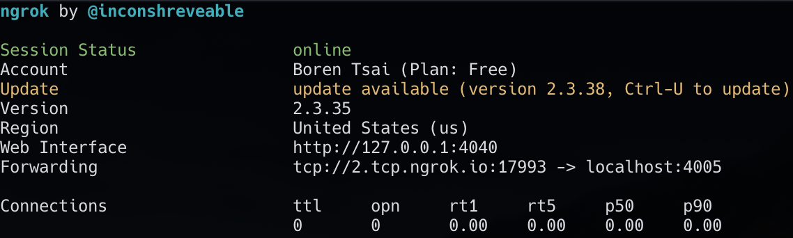

# Project 3：游戏共享

> 作者：Boren Tsai<br>
> 原始页面：<https://sp21.datastructur.es/materials/proj/proj3/proj3GameSharing>
>
> 本文件按照原页面的标题、段落、编号列表、代码块及示例顺序翻译。类名、方法名、命令、程序参数、IP 地址和端口示例保持原样。

我们为 Project 3：BYOW 添加了一项功能，允许任意两名学生远程玩对方的游戏。为新冠安全欢呼吧。

## 介绍

这里有两名 61B 学生 Alice 和 Bob。Alice 和 Bob 各自都做出了非常棒的游戏，并且都想玩对方的作品；可是因为居家令，他们无法见面。Alice 十分沮丧，于是去 Office Hours 表达失望。

幸运的是，助教 Arjun 接下了 Alice 的求助单，并告诉了她一个令人兴奋的消息：Alice 和 Bob 仍然能够玩对方的游戏！Arjun 先让 Alice 再次从 `skeleton` 拉取代码，然后解释说，Alice 可以使用课程提供的 `BYOWServer` 托管游戏，Bob 则可以使用 `BYOWClient` 连接并游玩。Arjun 把这一方案比作在线玩 Minecraft。客户端就是用户用来游玩游戏的程序。

客户端负责所有本地计算，例如图形、音频、UI（用户界面）以及记录输入。与此同时，远程服务器（即不在你的本地机器上）通过互联网监听并执行客户端输入。之后，服务器把渲染正确游戏状态、输出正确音频等所需的信息发送回客户端。

为了分享彼此的游戏，他们需要在 `Engine` 类中实现一个新方法：`interactWithRemoteClient`。

## 网络

为了实现这一功能，我们在 `proj3` 中加入了一层网络支持。核心功能已经在 `Networking` 文件夹中提供。你会在其中看到两个类：`BYOWClient` 和 `BYOWServer`。**重要：**为了获得这个文件夹，你需要再次从 `skeleton` 拉取代码。你不需要修改这两个文件中的任何一个。

如上所述，你需要在 `Engine.java` 中实现 `interactWithRemoteClient`。正如方法名所暗示的那样，你会在这个方法中使用 `BYOWServer` 与 `BYOWClient` 交互。这两个类已经完整实现，不需要作任何调整。`interactWithRemoteClient` 的参数是输入字符串 `-p [4-digit port number]`。

### Main

BYOW 服务器的“入口点”已经存在于你的代码中：

```java
else if (args.length == 2 && args[0].equals("-p")) {
    System.out.println("Coming soon.");
}
```

你要用支持服务器所需的代码替换这条打印语句。此外，需要修改 `main` 方法定义，让它抛出 `IOException`。下面给出课程的 `main` 方法作为参考；带 `+` 的行是要加入的内容。

```diff
+ public static void main(String[] args) throws IOException {
    if (args.length > 2) {
        System.out.println("Can only have two arguments - the flag and input string");
        System.exit(0);
    } else if (args.length == 2 && args[0].equals("-s")) {
        Engine engine = new Engine();
        engine.interactWithInputString(args[1]);
        System.out.println(engine.toString());
    } else if (args.length == 2 && args[0].equals("-p")) {
+       Engine engine = new Engine();
+       engine.interactWithRemoteClient(args[1]);
    } else {
        Engine engine = new Engine();
        engine.interactWithKeyboard();
    }
}
```

为了加入远程游戏共享，下面提供了文档和进一步的指导。

### BYOWServer

课程提供了一个 `BYOWServer` 类，它会替你完成所有网络魔法。你不需要修改该类，不过愿意的话也可以修改。`BYOWServer` 具有以下接口：

```java
public class BYOWServer {
    public BYOWServer(int port)

    public void sendCanvasConfig(int width, int height)
    public void sendCanvas()

    public boolean clientHasKeyTyped()
    public char clientNextKeyTyped()
    public void stopConnection()
}
```

创建 `BYOWServer` 时，必须提供一个 `port` 端口号。端口号可以是你任选的整数。我们建议选择至少四位的端口号，例如 4005。这个数字完全是任意的。如果以后修读网络课程，例如 CS 168，你会学到端口是什么。

实例化 `BYOWServer` 时，它会打印消息：

```text
Server started. Waiting for client to connect…
```

随后，构造器会一直等待，直到客户端连接。

客户端连接后，构造器会打印：

```text
Client connected!
```

为了与远程玩家通信，课程提供了以下方法：

1. 第一个方法 `sendCanvasConfig` 用来告诉客户端应创建多大的 StdDraw 窗口。单位为像素，并且应与 `TERenderer` 类中传给 `setCanvasSize` 的参数一致（第 35 行）。每当改变画布大小时，应当恰好调用一次此函数。作为参考，StdDraw 默认画布为 512 × 512 像素。
2. 第二个方法 `sendCanvas` 会发送托管计算机的 `StdDraw` 窗口内容。每次更新屏幕时都应调用此方法，也就是显式调用 `StdDraw.showCanvas()` 或 `TERenderer` 的 `renderFrame` 时。
3. 第三个方法 `clientHasKeyTyped` 与 `StdDraw` 中的 `hasNextKeyTyped` 方法类似。应使用它代替 `StdDraw.hasNextKeyTyped()`。
4. 第四个方法 `clientNextKeyTyped` 与 `StdDraw` 中的 `nextKeyTyped` 方法类似。应使用它代替 `StdDraw.nextKeyTyped()`。
5. 第五个方法 `stopConnection` 用于提示客户端停止显示 StdDraw 画布，然后终止连接。建议在游戏退出前调用该方法。

我们建议创建一个行为与 `interactWithKeyboard` 非常相似的 `interactWithRemoteClient` 方法。只要设计得当，就能避免代码重复，不过你可能会发现，让代码在正确时间调用 `sendCanvas` 有一点烦人。作为参考，Josh Hug 在一年没有看过自己 BYOW 客户端的情况下，为它添加服务器功能大约花了 30 分钟。

### BYOWClient

课程还提供了一个 `BYOWClient` 类。这是一个完整类，可以直接运行。运行该类的 main 方法时，程序会要求你提供 `IP address` 和 `port`。

若要在本地测试，请为 `IP address` 输入 `localhost`；当程序要求输入 `port` 时，给出实例化 `BYOWServer` 时使用的同一个数字。例如，如果采用课程建议，这个数字就是 `4005`。示例如下：

```text
BYOW Client. Please Enter the following information to connect to a server...
IP Address: localhost
Port (this must be a number): 4005
CONFIGURING CANVAS
```

### 测试你的代码

实现 `interactWithRemoteClient` 后，先用命令行参数 `-p 4005`（或你选择的其他端口号）运行 `Main`。然后运行 `BYOWClient`，输入 `localhost` 和相同的端口号。此时应打开两个 StdDraw 窗口，一个代表服务器，另一个代表客户端。如果实现正确，这两个窗口应显示相同内容。

### 支持远程游戏

当你成功得到两个互相镜像的 `StdDraw` 窗口——一个用于服务器，一个用于客户端——就可以开始实现真正的多人游戏了。

如果你还没有实现 `interactWithRemoteClient`，请**回头**先完成它。正确实现 `interactWithRemoteClient` 后，才算做好支持远程游戏的准备。

首先，需要下载一个超级酷的软件 ngrok。注册账号并下载它。把 `ngrok` 可执行文件加入 `PATH` 环境变量；在终端中使用：

```bash
export PATH=$PATH:[path to ngrok executable]
```

例如，如果可执行文件位于 Downloads 文件夹，上面的命令就是：

```bash
export PATH=$PATH:~/Downloads/
```

现在，假设已经把 `ngrok` 可执行文件加入 PATH，并且使用端口 `4005`，打开一个新终端并运行：

```bash
ngrok tcp 4005
```

该命令会把服务器使用的 `localhost:4005` 暴露给整个互联网，让其他人能够使用 `tcp` 协议连接。运行该命令后，终端会显示原页面中的示意图。



在 `Forwarding` 一行中，可能会看到：

```text
tcp://2.tcp.ngrok.io:17993 -> localhost:4005
```

实际上，这会把本机的 `localhost:4005` 暴露到互联网。只要 ngrok 会话仍在运行，所有发送到 `tcp://2.tcp.ngrok.io:17993` 的信息都会被转发到本机的 `localhost:4005`。在这个例子中，ngrok 隧道的 `IP address` 是 `2.tcp.ngrok.io`，`port` 是 `17993`。注意，填写 `IP address` 时不需要 `tcp://` 前缀。

下面看看怎样使用 `ngrok` 让互联网上的人连接到你的 BYOW Server。首先，以程序参数 `-p 4005` 运行 `Main` 类的 main 方法。接着在新终端中输入 `ngrok tcp 4005`。把 ngrok 打开的隧道的 `IP address` 和 `port` 发给朋友。朋友运行 `BYOWClient` 后，在客户端中输入你发给他的这些信息。

连接建立后，**TADA！**你的朋友现在应该能够远程玩你的游戏，而你可以在一旁观看。

注意：这还带来了一些有趣的可能性，例如让服务器在玩家游戏过程中修改世界。玩得开心。

### 一分悬赏

原则上，可以制作一个基于网页的客户端。课程工作人员还没有这样做。不过，如果有人创建了一个能够连接 BYOW 服务器的网站，课程会奖励你 **1 个额外加分点**，并且未来很可能把它作为官方课程资源。

## 免责声明

由于保存 StdDraw 画布会产生额外开销，同时网络本身也有限制，因此远程功能很可能会出现延迟。这完全正常，也是预期行为。希望你能享受玩彼此游戏的过程。

---

原始来源：[CS61B Spring 2021](https://sp21.datastructur.es/materials/proj/proj3/proj3GameSharing){ target="_blank" rel="noopener" } · 中文整理：everlasting · [CC BY-NC-SA 4.0](https://creativecommons.org/licenses/by-nc-sa/4.0/deed.zh-hans){ target="_blank" rel="license noopener" }
